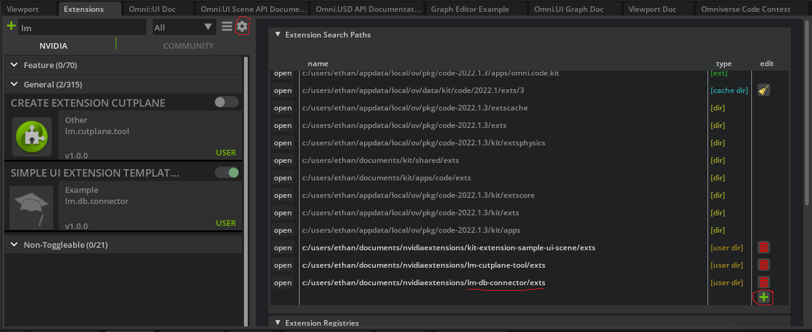

# LM Database Connector Omniverse Kit Extension

This project's purpose is to connect library parts and meshes stored in USD format to a SQL database that stores detailed and relevant information about each part. This allows for the maintance of a highly detailed, portable, and accurate digital twin for use in modeling and integration testing of various scenarios.

# Enabling this extension in Kit

This application works in any Omniverse Kit application the has an active Viewport window. To enable it, 

- Clone this repository to a desired place on your machine using
> git clone https://github.com/Brett-Amberge/lm-db-connector.git
- Open the Kit extension manager by going to Window > Extensions.
- Click the gear icon in the top right of the search window. This opens the Extensions Search Path menu.
- Click the green + icon to add an additional path
- Copy the path to the `exts` file in the location that you cloned the repository

The extension will now appear in the search pane on the right. Simply toggle it on to enable it.

# How to use this extension

Once the extension is enabled, a UI window will appear prompting for user credentials to connect to the database. Input your login information to connect, then selected any object in the scene. This will query the database using data stored in its USD file to see if information on that object is stored, then will display any info retrieved from the query in the Database Info window.

